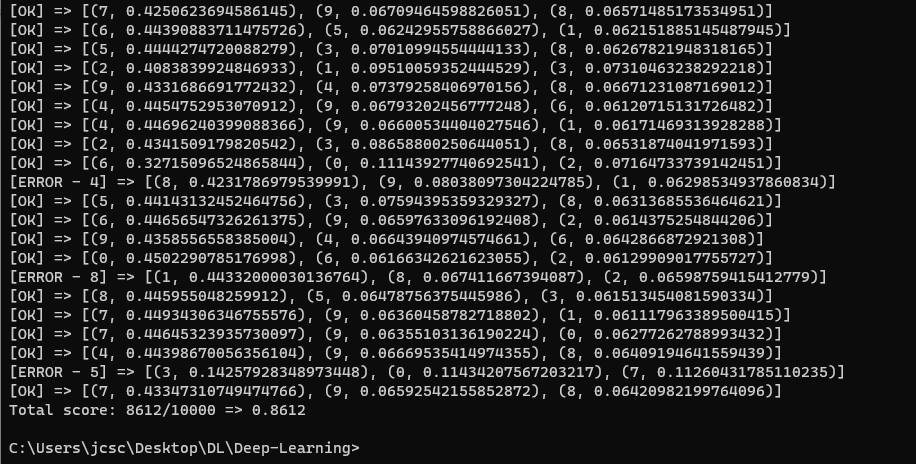

# Deep-Learning
Uma rede neural baseada no deeplearningbook.com.br 
Com o dataset do MNIST, a rede conseguiu um desempenho de 85% de acertos. 
Segue um log com os resultados, cada linha informa se a rede acertou a imagem ou não.
Seguindo de uma tupla com 3 elementos (p, rate): 
   p: valor que a rede acredita ser a imagem [0,9]
   rate: taxa de confiança em relação àquele valor. [0,1]

